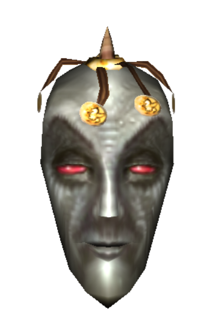
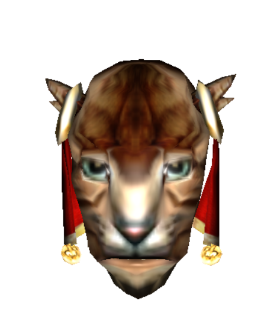

# Morrowind Three.JS

A project that takes morrowind's player heads and shows it on a webpage - [see it live](https://zt.je/mw/)

 

## Requirements

- pyFFI
- yarn / npm

# Setup

```bash
cd [project]

# Copy textures
cp [morrowind]/Data\ Files/Textures/TX_B_N_*  ./public/blob/textures
# Generate JSON meshes
./script/export_nif.py [morrowind]/Data\ Files/Meshes/b > ./public/blob/meshes.json
# Pack JS
yarn
yarn webpack
# Run dev http server via PHP e.g.
cd public;
php -S 0:8888;
```

meshes.json is not included because it's easily around 15MB